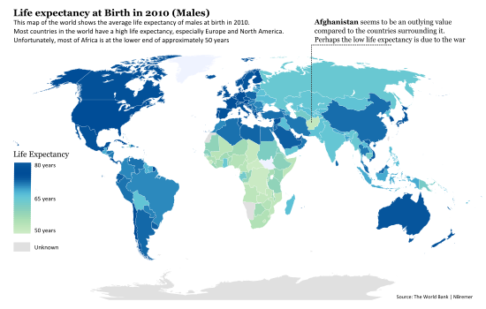
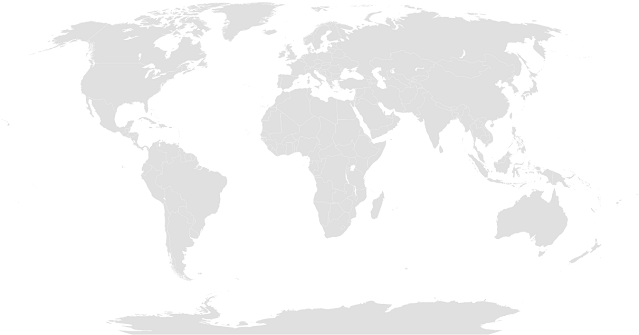
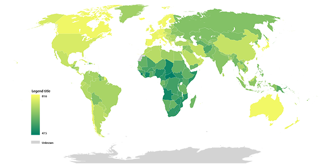
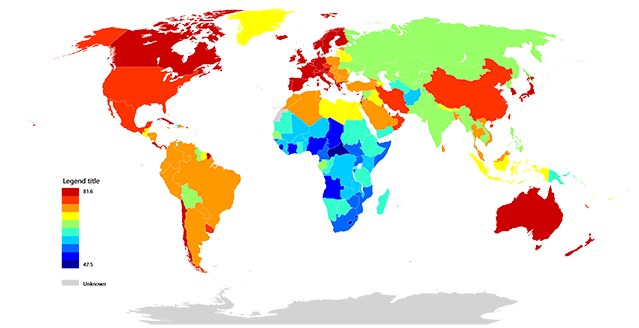

# Rendering GIS data on world map

The new VB.NET language that applied in data science.

For the furthering developement of this program, install the Microsoft VisualBasic CLI App runtime from nuget at first:
```
PM> Install-Package VB_AppFramework
```
And then add reference to these dll modules:

+ Microsoft.VisualBasic.Architecture.Framework_v3.0_22.0.76.201__8da45dcd8060cc9a.dll (VB.NET runtime core)
+ Microsoft.VisualBasic.Data.Csv.dll
+ Microsoft.VisualBasic.MIME.Markup.dll
+ Microsoft.VisualBasic.Imaging.dll

##### Acknowledgement

All of the programming idea in this post comes from this article on website ``VISUAL CINNAMON``


> Showing Life Expectancy around the World: http://www.visualcinnamon.com/2013/03/showing-life-expectancy-around-world.html

## Introduction & Background

## Using the Code

### 1. The blank world map SVG


> source from wiki: [File:**BlankMap-World6.svg**](https://en.wikipedia.org/wiki/Wikipedia:Blank_maps#/media/File:BlankMap-World6.svg)

Here is the blank map data that i download from wiki and makes some tweaks: removes the small region circle to solve the GIMP rendering problem and removes the oceans drawing Polygon path data, so that the final map it looks like:



This modified blank map svg data can be found at my github repository: https://github.com/xieguigang/Data.GIS/blob/master/data/BlankMap-World6.svg

### 2. How to rendering the colors on SVG Polygon?

From the observation on the data structure of the SVG elements in the blank world map data, that we can know that all of the svg graphics object ``g`` and polygon object ``path`` have the ``style`` attribute for applying CSS style and ``id`` attribute for identify the country or region object, here is a example of the svg document:

```xml
<g style="fill: rgb(204,0,0);" id="fr">
   ...
   <path style="fill: rgb(204,0,0);" class="landxx fr gf eu" id="gf" d="..." />
   <title>France</title>
</g>
```

**So that all we needs to do just found the country or region object by using the ``id`` attribute and then calculate the mapped color for that object and set the CSS value string to the ``style`` attribute, that we can done our job on this rendering work.**

### 3. The color renderer

#### Using ISO-3166_1 found svg object

```vbnet
Imports Microsoft.VisualBasic.Serialization.JSON

Public Class ISO_3166

    Public Property name As String
    Public Property alpha2 As String
    Public Property alpha3 As String
    Public Property code As String

    Public Overrides Function ToString() As String
        Return Me.GetJson
    End Function
End Class
```

And by creates this dictionary will makes the input country name compatible with all fields in the ISO-3166_1 data. And then by using this dictionary that we can translate the input keyword as the iso-3166-1 alpha2 code for finding the svg graphics or path object.

```vbnet
Public ReadOnly statDict As Dictionary(Of String, String)

statDict = (From x As ISO_3166
            In __iso_3166
            Select {
                x.name.ToLower,
                x.alpha2,
                x.alpha3,
                x.code}.Select(Function(code) New With {
                    .code = code,
                    .alpha2 = x.alpha2
                })).MatrixAsIterator.ToDictionary(
                    Function(x) x.code,
                    Function(x) x.alpha2)
```

So that by using the iso-3166 alpha2 code, that we can found any country object in the map svg data by using the code below:

```vbnet
''' <summary>
''' thanks to the XML/HTML style of the SVG (and Nathan’s explanation) I can create CSS classes per country
''' (the polygons of each country uses the alpha-2 country code as a class id)
''' </summary>
''' <param name="map"></param>
''' <param name="code"></param>
''' <returns></returns>
<Extension>
Private Function __country(map As SVGXml, code As String) As node
    Dim alpha2 As String =
        If(statDict.ContainsKey(code),
        statDict(code),
        statDict.TryGetValue(code.ToLower))
    Dim c As node = map.gs.__country(alpha2)

    If c Is Nothing Then
        c = map.path.__country(alpha2)

        If c Is Nothing Then
            Call $"Unable found Object named '{code}'!".PrintException
        End If
    End If

    Return c
End Function

<Extension>
Private Function __country(subs As path(), alpha2 As String) As path
    For Each path As path In subs.SafeQuery
        If path.id.TextEquals(alpha2) Then
            Return path
        End If
    Next

    Return Nothing
End Function

<Extension>
Private Function __country(subs As g(), alpha2 As String) As node
    Dim state As New Value(Of node)

    For Each c As g In subs
        If alpha2.TextEquals(c.id) Then
            Return c
        Else
            If c.gs.IsNullOrEmpty Then
                Continue For
            End If
        End If

        If Not (state = c.gs.__country(alpha2)) Is Nothing Then
            Return state
        End If

        If Not (state = c.path.__country(alpha2)) Is Nothing Then
            Return state  ' fix error for GF island
        End If
    Next

    Return Nothing
End Function
```

#### Level Mappings

By measure the difference of value ``x`` with the minimum value of the vector elements, and then calculate the proportion by Divided the difference with the extreme distance of the max and min value in the input vector, that we can do a linear scale mapping of the input data:

```vbnet
For Each x As Double In array
    Dim lv As Integer = CInt(Level * (x - MinValue) / d)
    chunkBuf(++i) = lv + offset
Next
```

Here is the linear mapping function that defined in VisualBasic:
Microsoft.VisualBasic.Mathematical::[ScaleMaps.GenerateMapping(System.Collections.Generic.IEnumerable(Of Double), Integer, Integer) As Integer()](https://github.com/xieguigang/VisualBasic_AppFramework/blob/master/Microsoft.VisualBasic.Architecture.Framework/Extensions/Math/ScaleMaps.vb)

```vbnet
''' <summary>
''' Linear mappings the vector elements in to another scale within specifc range from
''' parameter <paramref name="Level"></paramref>.
''' (如果每一个数值之间都是相同的大小，则返回原始数据，因为最大值与最小值的差为0，无法进行映射的创建
''' （会出现除0的错误）)
''' </summary>
''' <param name="data">Your input numeric vector.</param>
''' <param name="Level">The scaler range.</param>
''' <returns></returns>
''' <remarks>为了要保持顺序，不能够使用并行拓展</remarks>
''' <param name="offset">
''' The default scaler range output is [1, <paramref name="Level"></paramref>],
''' but you can modify this parameter value for moving the range to
''' [<paramref name="offset"></paramref>, <paramref name="Level"></paramref> +
''' <paramref name="offset"></paramref>].
''' (默认是 [1, <paramref name="Level"></paramref>]，当offset的值为0的时候，则为
''' [0, <paramref name="Level"></paramref>-1]，当然这个参数也可以使其他的值)
''' </param>
<ExportAPI("Ranks.Mapping")>
<Extension> Public Function GenerateMapping(data As IEnumerable(Of Double), Optional Level As Integer = 10, Optional offset As Integer = 1) As Integer()
    Dim array As Double() = data.ToArray
    Dim MinValue As Double = array.Min
    Dim MaxValue As Double = array.Max
    Dim d As Double = MaxValue - MinValue

    If d = 0R Then ' 所有的值都是一样的，则都是同等级的
        Return 1.CopyVector(array.Length)
    End If

    Dim chunkBuf As Integer() = New Integer(array.Length - 1) {}
    Dim i As int = 0

    For Each x As Double In array
        Dim lv As Integer = CInt(Level * (x - MinValue) / d)
        chunkBuf(++i) = lv + offset
    Next

    Return chunkBuf
End Function
```

#### Generates the color patterns


The color maps in this tools have eight patterns:

```vbnet
''' <summary>
''' Spring
''' </summary>
Public Const PatternSpring As String = "Spring"
''' <summary>
''' Summer
''' </summary>
Public Const PatternSummer As String = "Summer"
''' <summary>
''' Autumn
''' </summary>
Public Const PatternAutumn As String = "Autumn"
''' <summary>
''' Winter
''' </summary>
Public Const PatternWinter As String = "Winter"
''' <summary>
''' Jet
''' </summary>
Public Const PatternJet As String = "Jet"
''' <summary>
''' Gray
''' </summary>
Public Const PatternGray As String = "Gray"
''' <summary>
''' Hot
''' </summary>
Public Const PatternHot As String = "Hot"
''' <summary>
''' Cool
''' </summary>
Public Const PatternCool As String = "Cool"
```

The color pattern generated code can be found at this codeproject article:
> "Create Custom Color Maps in C#": http://www.codeproject.com/Articles/18150/Create-Custom-Color-Maps-in-C

And also additional three color pattern are provides from this R script result:

```R
require(fields)
# Loading required package: fields
# Loading required package: spam
# Loading required package: grid
# Spam version 1.3-0 (2015-10-24) is loaded.
# Type 'help( Spam)' or 'demo( spam)' for a short introduction 
# and overview of this package.
# Help for individual functions is also obtained by adding the
# suffix '.spam' to the function name, e.g. 'help( chol.spam)'.
#
# Attaching package: ‘spam’
#
# The following objects are masked from ‘package:base’:
#
#     backsolve, forwardsolve
#
# Loading required package: maps
#
#   maps v3.1: updated 'world': all lakes moved to separate new #
#   'lakes' database. Type '?world' or 'news(package="maps")'.  #

designer.colors(n=10, col=c("#CCEBC5", "#A8DDB5", "#7BCCC4", "#4EB3D3", "#08589E", "#08589E"))
designer.colors(n=256, col=c("#CCEBC5", "#A8DDB5", "#7BCCC4", "#4EB3D3", "#08589E", "#08589E"))
designer.colors(n=512, col=c("#CCEBC5", "#A8DDB5", "#7BCCC4", "#4EB3D3", "#08589E", "#08589E"))
```

#### Fill color on ploygon

```vbnet
<Extension> Public Sub FillColor(ByRef g As node, color As String)
    g.style = $"fill: {color};"  ' path/g

    If TypeOf g Is g Then
        Dim x As g = DirectCast(g, g)

        For Each [sub] As g In x.gs.SafeQuery
            Call [sub].FillColor(color)
        Next

        For Each path As path In x.path.SafeQuery
            path.style = g.style
        Next
    End If
End Sub
```

#### Insert image into SVG

About how to embedded the image into SVG, please review on this stackoverflow problem: http://stackoverflow.com/questions/6249664/does-svg-support-embedding-of-bitmap-images

Here is the svg image object that define in VisualBasic language:

```vbnet
Public Class Image

    <XmlAttribute> Public Property x As Double
    <XmlAttribute> Public Property y As Double
    <XmlAttribute> Public Property width As String
    <XmlAttribute> Public Property height As String
    <XmlAttribute("image.data")> Public Property data As String

    ''' <summary>
    ''' ``data:image/png;base64,...``
    ''' </summary>
    Const base64Header As String = "data:image/png;base64,"

    Sub New()
    End Sub

    Sub New(image As Bitmap, Optional size As Size = Nothing)
        data = base64Header & image.ToBase64String
        If size.IsEmpty Then
            size = image.Size
        End If
        width = size.Width
        height = size.Height
    End Sub
End Class
```

And after the legend image was output from the ``DrawLegend`` function, that we can creates a svg image object and put on the specific position on the svg Image by calculated the x and y position value.

```vbnet
legend = designer.DrawLegend(title)
renderedMap.images = {                  ' 将所生成legend图片镶嵌进入SVG矢量图之中
    New SVG.Image(legend) With {
        .height = legend.Height * 0.5,
        .width = legend.Width * 0.5,
        .x = .width / 2,
        .y = renderedMap.height - .height
    }
}
```

## Example

A demo CLI tools for this rendering

### CLI tool

```vbnet
<ExportAPI("/Rendering",
           Usage:="/Rendering /in <data.csv> [/main <title> /legend.title <legend title> /map.levels <512> /map <map.svg> /map.Name <default> /out <out.svg>]")>
<ParameterInfo("/in", False,
               AcceptTypes:={GetType(Data)},
               Description:="A data file template example can be found in the ./Templates/ folder.")>
<ParameterInfo("/map.levels", True, AcceptTypes:={GetType(Integer)},
               Description:="Any positive integer value, this will adjust the color depth for the value mappings.")>
<ParameterInfo("/map", True,
               Description:="User custom map svg, please note that the id attribute of the ``g`` or ``path`` object in the svg stands for the country for region should be the iso-3166-1 alpha2 code.")>
<ParameterInfo("/map.Name", True, AcceptTypes:={GetType(String)},
               Description:="The color map pattern profile name, the VisualBasic language build in color patterns name can be found at github: https://github.com/xieguigang/VisualBasic_AppFramework/tree/master/gr
               And this value is set as ``default`` if this parameter is not specified, in this situation, the parameter value of /map.levels is only allowd 256 or 512.")>
Public Function Rendering(args As CommandLine) As Integer
    Dim [in] As String = args("/in")
    Dim map As String = args("/map")
    Dim iso_3166 As String = args("/iso_3166")
    Dim levels As Integer = args.GetValue("/map.levels", 512)
    Dim mapName As String = args.GetValue("/map.Name", "default")
    Dim main As String = args("/main")
    Dim out As String = args.GetValue(
        "/out",
        [in].TrimSuffix & $".rendering;levels={levels},map.Name={mapName}.svg")
    Dim data As IEnumerable(Of Data) = [in].LoadCsv(Of Data)
    Dim legend As Bitmap = Nothing
    Dim legendTitle As String = args.GetValue("/legend.title", "Legend title")
    Dim svg As SVGXml = data.Rendering(
        levels,
        mapTemplate:=map.ReadAllText(throwEx:=False, suppress:=True),
        mapName:=mapName,
        legend:=legend,
        title:=legendTitle)
    If Not String.IsNullOrEmpty(main) Then
        svg.title = main
    End If
    Return svg.SaveAsXml(out).CLICode
End Function
```

###### CLI usage

```bash
/Rendering /in <data.csv> [/main <title> /legend.title <legend title> /map.levels <512> /map <map.svg> /map.Name <default> /out <out.svg>]
```

#### Gallery

###### Test rendering with ``/map.levels = 512, /map.Name = Summer``


###### Test rendering with ``/map.levels = 20, /map.Name = Jet``
